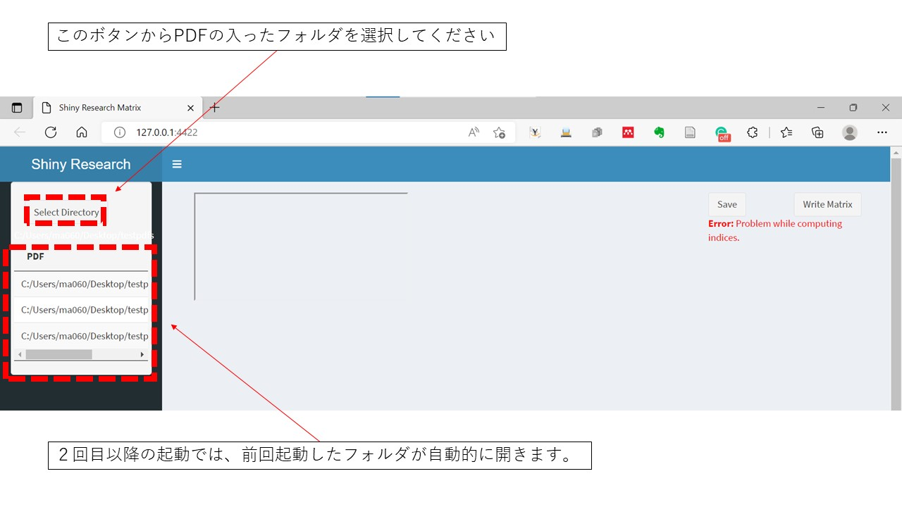
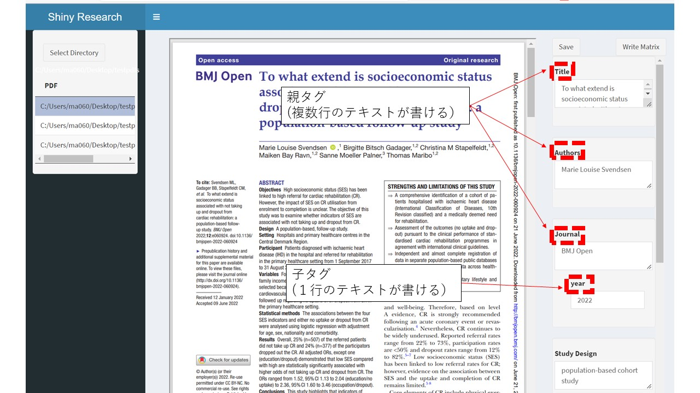
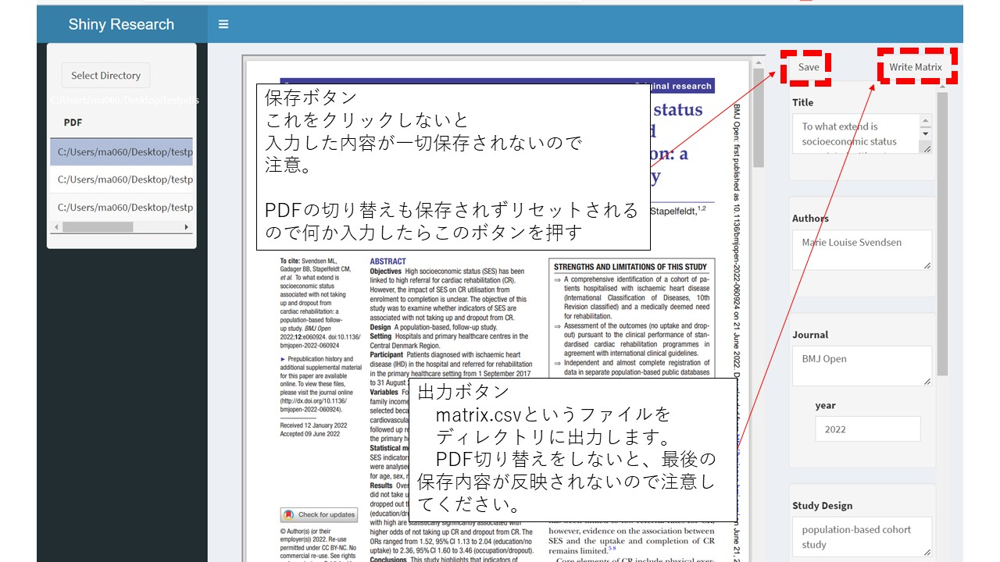
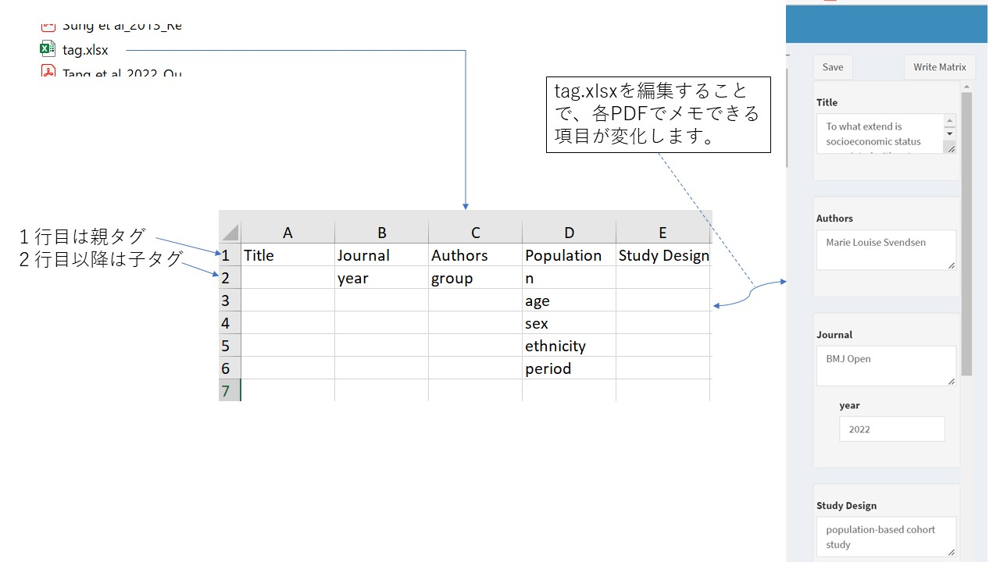
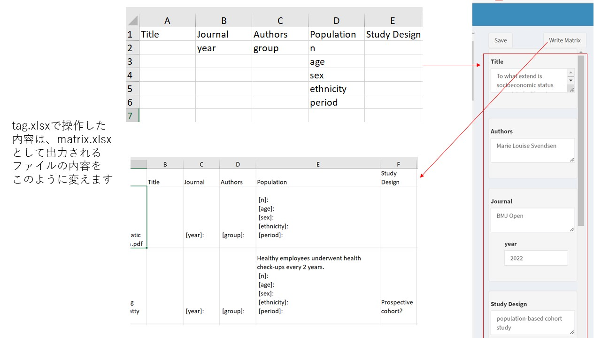

# Shiny-Matrix

このShinyアプリは、論文を書く場合に必要となる、先行研究の特徴をマトリクスにまとめた、「先行研究マトリクス」を効率的に作成するためのアプリです。ローカルで動かすことを想定しております。（オンラインでは動きません）

バグは多数残っていますが、実用的にはそこまで問題ないと思います。

## 前提条件

このアプリの利用には、R言語とRStudioのインストールが終わっていることが必要です。
またRのShinyを起動させる必要があります。

**宣伝**：R、RStudio、Shiny等がわからない方は、このような[オンラインコース](https://r-online-course.netlify.app/#hero)を作っていたりするのでよろしければご購入ください。

## 使い方

### ディレクトリの選択

**このアプリケーションは個人用に作成しているものです。動作保証はいたしかねます。また意図していない動作で生じたデータの消失等を含めて一切保証しかねます。**

マトリクスにしたい文献のPDFファイルをまず準備して、それを「ひとつのフォルダ」にまとめておいてください。このアプリ、自動的にrdsファイルやエクセルファイルを生成するため、**かならず空のフォルダにPDFをコピーしておいてください。**
（tag.xlsx、matrix.xlsx等のファイルがあるフォルダにPDFをおいて、そのフォルダを対象としてアプリを走らせると、それらのファイルが上書きされてしまいます。）

app.RからShinyアプリを立ち上げると、次のような画面になります。

基本的には、最初は左上のボタンからPDFファイルがおいてあるディレクトを選択してください。

ディレクトリを選択するとそのディレクトリに、タグデータの設定用のエクセルや、入力したタグデータを保存したrdsファイルなどが自動的に作成されます。拡張子がPDFのファイル意外は無視する設定にしていますが、繰り返すように、自動的にファイルが生成されるので、PDF以外のファイルはおかないようにした方が意図しない動作は起こらないと思います。

ディレクトリを選択したら、ボタンの下に表示されるPDFファイルを選択してください。

### PDFファイルからタグ内容の入力

このアプリは二種類のタグを使ってデータを書き留めることが可能です。タグの設定方法は後で説明します。親タグは複数行の長いテキスト、子タグは１行程度の短いテキストを書くことが可能です。

**注意** このアプリ、タグの上の部分の保存ボタンを押すことでデータが保存されます。それ以外の保存方法がないので、数十分かけて入力して、保存を忘れて次のPDFに移動したりすると、入力内容が消えますので、**こまめにSaveボタンを押してください**。

キチンと保存された場合は別のPDFに移動して戻ってきても、内容がちゃんと保存されているはずです（逆に移動してきて戻ってきて、内容が表示されていない場合は保存に失敗しています）

マトリクスい入れたいPDFファイルすべての入力が終了したら、右上の出力ボタンをクリックしてください。PDFがおいてあるディレクトリに、matrix.xlsxファイルが出力されます。

**注意**：マトリクスファイルへの出力のさい、PDFの移動をしないと保存した内容がうまく出力されません。そのため、最後のPDFの入力がおわったら、一度別のファイルに切り替えてから出力ボタンを押してください。

#### タグデータの編集

PDFをおいているディレクトリにtag.xlsxファイルというものができているはずです。このファイルに記載してある通りにtagが表示されるため、このファイルを編集することで、tagを好みのものに変更することができます。

１行目に親タグ、その親タグにぶら下げたい子タグを２行目以降に書く形です。アプリ起動中にtag.xlsxファイルを編集した場合は、保存したあと、アプリを再起動するか、ブラウザを再読み込みしていただくと、タグデータが反映されているはずです。

**注意**：一応、タグデータを削除した場合でも、同じ名前のタグをつけるとその内容が復活するような処理をかいていますが、時間がなかったので動作の検証していません。原則、タグはあまり削除しないで運用いただくと現時点ではよいと思います。

### タグと出力の関係

親タグ、子タグは出力されるマトリクスファイルの内容にこのように影響を与えます。独立した列として表示したければ、親タグを利用する。親タグの細かい特徴を並べたければ、子タグを利用するというイメージです。

以上、簡単にですが使い方でした。

もしよいという方がいたらコーヒーおごってください。

↓↓↓

宣伝；あと、こんなアプリが作れるR言語ってすごい！！学んでみたい！！と思った方がいらっしゃれば、[オンラインコース](https://r-online-course.netlify.app/#hero)も2000円未満（クーポン適応価格）で販売しているので、ちょっとのぞいていっていただけると嬉しいです。